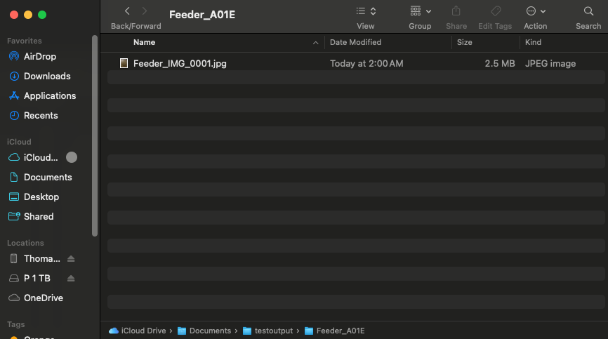
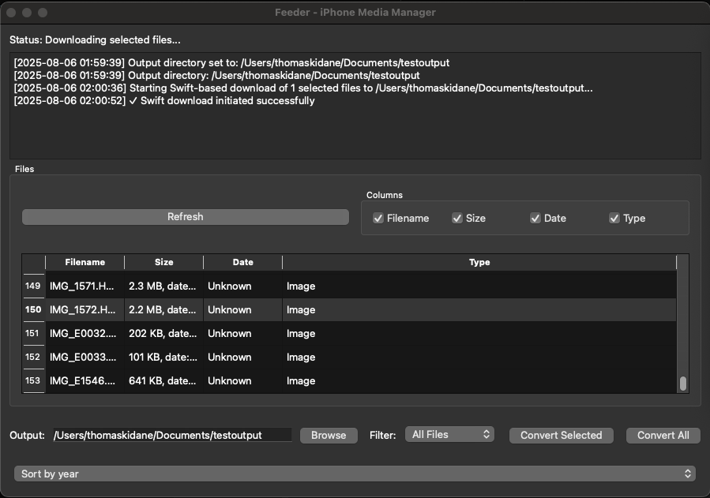

# Feeder - iPhone Photo & Video Transfer & Conversion Tool

A macOS desktop application that automatically transfers, converts, and intelligently labels photos and videos from connected iPhones.

## Features

### ✅ Core Functionality
- **iPhone Detection** - Automatically detects connected iPhone/iOS devices
- **File Transfer** - Downloads photos and videos from iPhone to local storage
- **Automatic Conversion** - Converts files to universal formats:
  - HEIC → JPG (using macOS `sips`)
  - MOV → MP4 (using FFmpeg)
- **Human-readable File Sizes** - Displays sizes as "2.2 MB", "7.9 MB" instead of raw bytes
- **Metadata Extraction** - Extracts and displays creation dates from files
- **Selective Download** - Choose specific files to download and convert
- **Batch Processing** - Download and convert all files at once

### 🎯 User Interface
- **Modern Qt 6 GUI** - Clean, intuitive interface
- **File Browser** - View all photos/videos on iPhone with details
- **Progress Tracking** - Real-time download and conversion progress
- **Output Directory Selection** - Choose where converted files are saved
- **File Type Filtering** - Filter by Images Only, Videos Only, or All Files
- **Customizable Columns** - Show/hide filename, size, date, and type columns

## Screenshots

### Main Application Window


### File Management Interface


## System Requirements

- **macOS**: Big Sur (11.0) or later
- **iPhone**: iOS 12 or later
- **FFmpeg**: Required for video conversion (installed via Homebrew)
- **Qt 6**: Included in build

## Installation

### Prerequisites

1. **Install FFmpeg** (for video conversion):
   ```bash
   brew install ffmpeg
   ```

2. **Install Qt 6** (if not already installed):
   ```bash
   brew install qt6
   ```

### Building from Source

1. **Clone the repository**:
   ```bash
   git clone <repository-url>
   cd feeder
   ```

2. **Create build directory**:
   ```bash
   mkdir build
   cd build
   ```

3. **Configure with CMake**:
   ```bash
   cmake ..
   ```

4. **Build the application**:
   ```bash
   make
   ```

5. **Sign the application** (required for device access):
   ```bash
   codesign --force --deep --sign - feeder.app
   ```

## Usage

### First Time Setup

1. **Connect your iPhone** via USB cable
2. **Trust the computer** on your iPhone when prompted
3. **Launch Feeder**:
   ```bash
   ./feeder.app/Contents/MacOS/feeder
   ```

### Using the Application

1. **Device Detection**:
   - The app automatically detects your iPhone
   - Click "Refresh" if device isn't detected immediately

2. **View Files**:
   - All photos and videos on your iPhone are displayed in the table
   - Use filters to show only images, videos, or all files
   - Customize which columns to display

3. **Select Files**:
   - Click individual files to select them
   - Use "Convert Selected" to download and convert specific files
   - Use "Convert All" to process all files

4. **Choose Output Directory**:
   - Click "Browse Output" to select where converted files are saved
   - Default location: `~/Downloads/FeederOutput`

5. **Monitor Progress**:
   - Watch the progress bars for download and conversion
   - Check the log area for detailed status updates

### File Conversion

The app automatically converts files after download:

- **HEIC Images** → **JPG** (using macOS `sips`)
- **MOV Videos** → **MP4** (using FFmpeg)
- **Original files** are deleted after successful conversion
- **File names** are preserved (only extension changes)

### Output Structure

```
~/Downloads/FeederOutput/
├── Feeder_A01E/
│   ├── IMG_1566.jpg          # Converted from HEIC
│   ├── IMG_1562.mp4          # Converted from MOV
│   └── ...
└── ...
```

## Architecture

### Components

1. **C++ Qt Application** (`feeder/`)
   - Main GUI application
   - File browser and user interface
   - Integration with Swift wrapper

2. **Swift Wrapper** (`feeder/src/swift_wrapper.cpp`)
   - Bridges C++ app with Swift functionality
   - Handles device communication
   - Manages file operations

3. **Swift Command-line App** (`FeederSwiftApp/`)
   - Standalone Swift application
   - Uses ImageCaptureCore framework
   - Handles iPhone device communication
   - Downloads files from iPhone

### Technology Stack

- **C++** - Main application logic
- **Qt 6** - GUI framework
- **Swift** - iPhone device communication
- **ImageCaptureCore** - macOS framework for device access
- **FFmpeg** - Video conversion
- **sips** - macOS built-in image conversion
- **CMake** - Build system

## Troubleshooting

### Device Not Detected

1. **Check USB Connection**:
   - Ensure iPhone is connected via USB cable
   - Try a different USB cable or port

2. **Trust Settings**:
   - On iPhone, tap "Trust This Computer" when prompted
   - Enter your iPhone passcode

3. **App Signing**:
   - Ensure the app is properly signed:
   ```bash
   codesign -dv feeder.app
   ```

4. **Permissions**:
   - Check that the app has necessary entitlements
   - Verify `feeder.entitlements` file exists

### Conversion Issues

1. **FFmpeg Not Found**:
   ```bash
   brew install ffmpeg
   ```

2. **Permission Errors**:
   - Check output directory permissions
   - Ensure write access to Downloads folder

3. **Conversion Timeout**:
   - Large files may take longer to convert
   - Check available disk space

### Build Issues

1. **CMake Errors**:
   ```bash
   rm -rf build
   mkdir build && cd build
   cmake ..
   make
   ```

2. **Qt Not Found**:
   ```bash
   brew install qt6
   ```


## Contributing

1. Fork the repository
2. Create a feature branch
3. Make your changes
4. Test thoroughly
5. Submit a pull request

## License

This project is licensed under the MIT License - see the [LICENSE](LICENSE) file for details.

This software uses Qt 6 (LGPL v3). Users have the right to relink
this application with different versions of Qt 6. Qt source code
is available at: https://www.qt.io/download

## Acknowledgments

- **ImageCaptureCore** - Apple's framework for device communication
- **Qt 6** - Cross-platform GUI framework
- **FFmpeg** - Video conversion library
- **Homebrew** - Package manager for macOS

## Version History

- **v1.0.0** - Initial release with basic download and conversion functionality
- **v1.1.0** - Added human-readable file sizes and date extraction
- **v1.2.0** - Improved conversion pipeline with C++ integration

## Support

For issues and questions:
- Check the troubleshooting section above
- Review the logs in the application
- Check terminal output for detailed error messages

---

**Note**: This application requires proper code signing and entitlements to access iPhone devices. Make sure to sign the app before distribution. 